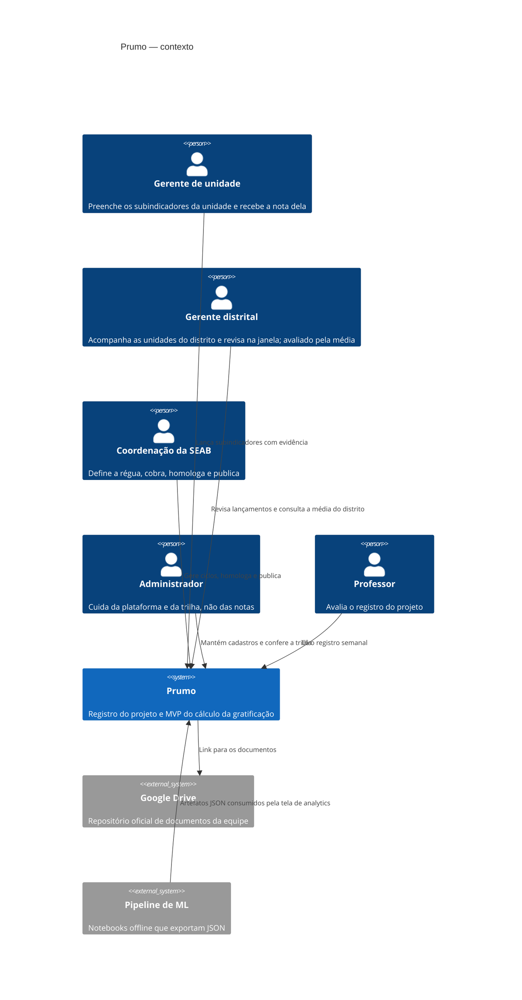
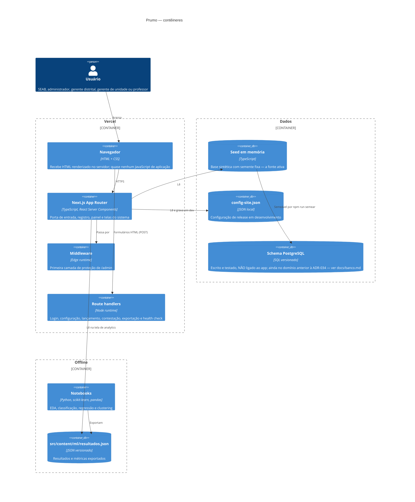
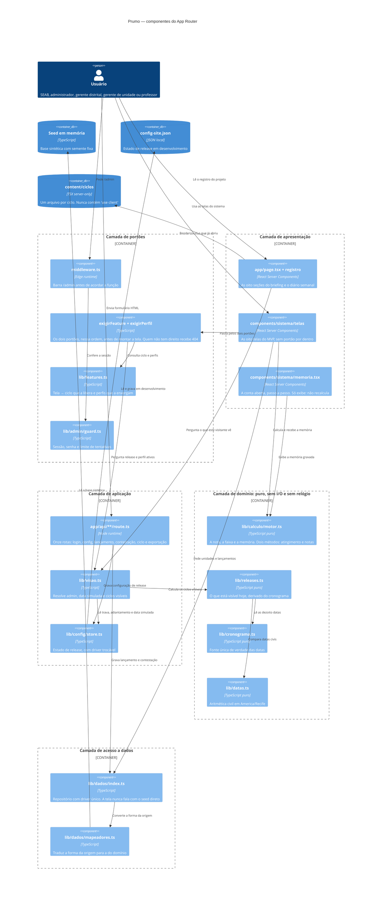
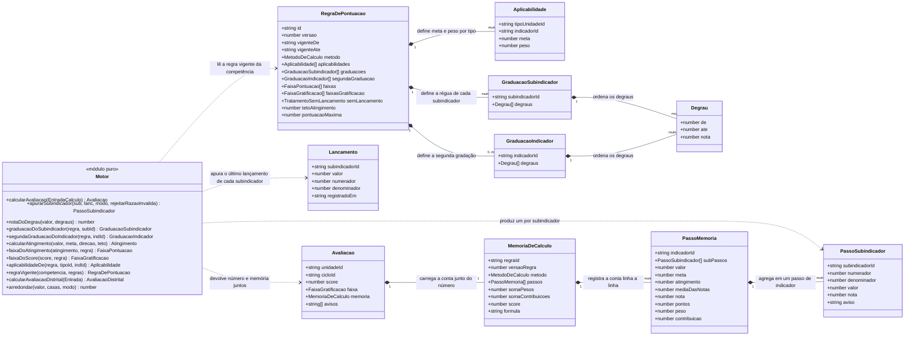
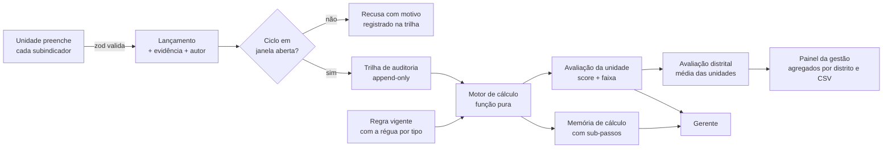

# Arquitetura

Este documento se lê em cadeia, e a ordem importa: as características priorizadas explicam a
decomposição, a decomposição explica o estilo, e o estilo é o que se enxerga nos desenhos. Quem
quiser conferir a coerência pode ler de cima para baixo e cobrar cada passo do anterior.

| Onde | O quê |
| --- | --- |
| Características arquiteturais | O que este domínio exige, em ordem, e o trade-off que a equipe teve de resolver de verdade |
| Mapeamento estratégico | Os contextos do domínio e os agregados de cada um, com as invariantes que eles protegem |
| Estilo arquitetural | Monólito modularizado em camadas, e o preço que se paga por ele |
| C4 níveis 1 a 4 | Os desenhos, em que o estilo aparece como fronteira |

## Características arquiteturais priorizadas

A ordem abaixo não é uma lista de qualidades desejáveis. Ela sai de três fatos do domínio, e
cada um deles empurra características diferentes para cima e para baixo:

1. **O resultado é contestável, e o prazo é curto.** O art. 9º da portaria dá dez dias corridos
   para o gestor recorrer e cinco dias úteis para a comissão responder. Um número que não pode
   ser refeito passo a passo dentro desse prazo é indefensável.
2. **A régua muda, e muda fora da norma.** A portaria foi revista, e a planilha do cliente tem
   duas colunas de peso, a "da portaria" e a "atual, excepcional", que não são iguais. O
   sistema tem de absorver mudança de regra como rotina, não como incidente.
3. **O volume é irrisório e o ritmo é mensal.** A rede tem centenas de unidades, não milhões, e
   a conta fecha uma vez por mês, dentro de uma janela. Não existe problema de escala aqui, e
   fingir que existe custaria complexidade sem comprar nada.

| # | Característica | Por que nesta posição | De onde vem a exigência |
| --- | --- | --- | --- |
| 1 | **Auditabilidade** | Todo resultado carrega a conta que o produziu. Sem isso o prazo de recurso é decorativo | Art. 9º da portaria |
| 2 | **Reprodutibilidade determinística** | O mesmo ciclo recalculado meses depois devolve o mesmo número. É o que separa um resultado de uma opinião | Art. 9º e o histórico de meses já pagos |
| 3 | **Evolutibilidade da regra** | Trocar meta, peso, faixa ou método não pode ser trocar programa | Revisão da portaria e a coluna "peso atual, excepcional" |
| 4 | **Segurança: autorização e não repúdio** | Quem informa o número não escolhe o alvo, e nada muda sem ficar registrado quem mudou | Art. 20 da LGPD e os quatro papéis da portaria |
| 5 | **Testabilidade** | É o meio pelo qual as três primeiras deixam de ser promessa | Consequência de 1, 2 e 3 |
| 6 | **Compreensibilidade para leigo** | Quem lê a conta é um gestor de posto de saúde, não um desenvolvedor. Memória ilegível não é auditável | Persona primária, Semana 2 |
| 7 | **Operabilidade e custo** | Sete estudantes, um semestre, e uma secretaria municipal. Ninguém vai cuidar de servidor | Restrição do projeto e do cliente |
| 8 | **Disponibilidade** | Baixa de propósito. A janela é mensal; uma hora fora do ar não custa nada a ninguém | Art. 7º: ciclo mensal com janela |
| 9 | **Desempenho e escalabilidade** | Baixas de propósito. Centenas de unidades, uma vez por mês | Porte real da rede |

As duas últimas estão no fim porque este domínio não as pede, e não porque a equipe as
despreza. Prioridade que não exclui nada não é prioridade.

### O trade-off que a equipe teve de resolver

**Reprodutibilidade (nº 2) contra corretude da regra (dentro da nº 3).** Elas parecem aliadas e
não são.

Em 22/09 a Secretaria enviou a planilha que usa hoje. Lendo as fórmulas, ficou claro que o
método que a equipe tinha implementado estava errado: nós tirávamos a média dos valores dos
subindicadores e graduávamos uma vez no fim; a conta real gradua cada subindicador primeiro e
tira a média das notas. Os dois caminhos dão números diferentes.

Isso criou um conflito direto entre duas coisas que o sistema promete:

- **Corrigir para todos.** Os meses já fechados foram calculados por um método que hoje sabemos
  errado. Recalcular tudo deixa o sistema coerente e correto.
- **Não mexer no que já foi publicado.** Recalcular muda números que já foram divulgados, e
  sobre os quais o prazo de recurso já correu.

Não dá para ter as duas. **A equipe escolheu a reprodutibilidade**, e a razão é do domínio, não
de engenharia: num sistema que decide remuneração, o número publicado é um fato com prazo
associado. Se ele pode mudar depois, o prazo do art. 9º perde o sentido, porque ninguém sabe
sobre qual versão está recorrendo.

**Como foi resolvido.** O método de cálculo virou campo da regra versionada (`metodo`), e não
uma escolha do código. As regras v1 e v2 seguem com o método antigo e continuam devolvendo
exatamente os mesmos números; a v3 nasce com o método certo e vale a partir do ciclo que ainda
estava aberto. A mesma lógica valeu para a validação de numerador maior que denominador, que a
planilha marca como erro: ligá-la para todos mudaria mês homologado, então ela também entrou
condicionada à versão da regra.

**O que se aceitou pagar.** O motor carrega dois caminhos de cálculo para sempre, e quem mexer
nele precisa conferir os dois. Um mês calculado sob a v2 é, hoje, sabidamente calculado por um
método em que não acreditamos mais, e o sistema não esconde isso: a memória de cálculo grava
qual método produziu cada número. Apagar o caminho antigo seria apagar a capacidade de
recalcular 2026, que é justamente o que a característica nº 2 exige.

O registro completo está na ADR-041.

### Outros dois trade-offs, mais curtos

**Segurança (nº 4) contra compreensibilidade (nº 6).** Quem pede uma tela a que não tem direito
recebe 404, nunca 403, e uma tela ainda não liberada responde igual a uma tela que não é do seu
perfil. O preço é uma mensagem de erro pior para quem só errou o endereço. Aceito: se as duas
respostas fossem distinguíveis, a porta contaria o que existe do outro lado.

**Disponibilidade (nº 8) contra operabilidade (nº 7).** O MVP não tem banco: a base vive em
memória e `git clone && npm run dev` funciona sem nenhuma credencial. O preço é que nada
persiste entre reinícios, e a escrita **não sobrevive a mais de uma instância**, o que está
detalhado no fim deste documento. Aceito para o MVP, e é a primeira coisa a cair quando houver
banco.

## Mapeamento estratégico: contextos e agregados

O domínio foi decomposto por **responsabilidade e invariante**, não por tela. A tela de
lançamento não é um componente: ela é um mecanismo de entrega sobre o contexto de Coleta, e
poderia ser substituída por uma importação de planilha sem que o domínio mudasse.

### Os contextos

| Contexto | Papel | Por que é uma fronteira |
| --- | --- | --- |
| **Avaliação de Desempenho** | Núcleo | É onde a linguagem do domínio é mais precisa e onde o erro custa mais caro. Tudo o mais existe para alimentá-lo ou para publicá-lo |
| **Cadastro da Rede** | Apoio | Muda devagar e por decisão administrativa, num ritmo completamente diferente do ciclo mensal |
| **Coleta** | Apoio | Tem ciclo de vida próprio (rascunho, enviado, validado, rejeitado) e prazos próprios, que não são os do cálculo |
| **Contestação** | Apoio | Nasce depois da publicação e é governada por prazos do art. 9º, não pela regra de pontuação |
| **Trilha de Auditoria** | Genérico | Atravessa todos os outros e não tem regra de negócio própria: só registra e nunca apaga |
| **Registro do Projeto** | Outro domínio | O site, o diário semanal e o pitch são sobre a disciplina, não sobre a SESAU. Compartilham o deploy e mais nada |

O último merece a menção justamente por não pertencer ao domínio do cliente. Ele divide o mesmo
processo por conveniência acadêmica, e a fronteira entre ele e o resto é a linha que teria de
ser cortada primeiro se isso virasse produto.

### Os agregados do núcleo

Cada agregado abaixo é nomeado pela sua raiz, e o que o define é a **invariante que ele
protege**: a regra que precisa valer sempre e que, por isso, não pode ser verificada em dois
lugares ao mesmo tempo.

**Regra de Pontuação** (raiz: `RegraDePontuacao`)
Contém Aplicabilidade, Graduação, Degrau e Faixa de Gratificação.
- *Invariante:* uma regra vigente nunca é editada. Mudar a régua é publicar outra versão.
- *Invariante:* para cada tipo de unidade, o conjunto de indicadores aplicáveis com seus pesos
  está completo, e a soma dos pesos é positiva.
- *Responsabilidade:* dizer o que conta, para quem, com que alvo, com que peso e em que período.

**Ciclo de Avaliação** (raiz: `CicloAvaliacao`)
- *Invariante:* o estado só anda para a frente (rascunho, lançamento aberto, em validação,
  homologado, publicado). Não há volta, porque voltar significaria reabrir dinheiro pago.
- *Invariante:* um ciclo se liga a exatamente uma versão de regra, escolhida pela competência,
  e essa ligação não muda depois.
- *Responsabilidade:* ser dono da janela e do estado.

**Lançamento** (raiz: `Lancamento`)
- *Invariante:* nada é apagado. Vale o último registrado, e os anteriores continuam existindo.
- *Invariante:* numa razão, o numerador não é maior que o denominador.
- *Responsabilidade:* guardar o que a unidade informou, com evidência e autor.

**Avaliação** (raiz: `Avaliacao`)
Contém Memória de Cálculo, Passo de Indicador e Passo de Subindicador.
- *Invariante:* nota e memória nascem juntas. Uma nota sem a conta que a produziu é inválida, e
  o tipo do sistema torna isso impossível de representar.
- *Invariante:* é sempre derivada, nunca digitada.
- *Responsabilidade:* ser o resultado auditável.

**Contestação** (raiz: `Contestacao`)
- *Invariante:* só existe sobre ciclo publicado, e dentro do prazo do art. 9º, que é de dez
  dias corridos para recorrer e cinco dias úteis para responder.
- *Invariante:* não altera a avaliação original. Discordar é um registro novo, não uma edição.
- *Responsabilidade:* registrar a discordância e a resposta.
- *Estado hoje:* o prazo é invariante do domínio e **ainda não está implementado**. A tela de
  contestação existe sem prazo, e ele entra junto com a `regra-v3`. Está na tabela de
  divergências no fim de `portaria-001-2024.md`, e é dito aqui para o mapa não descrever como
  pronto o que é projeto.

### Os componentes lógicos

Deles saem, direto, as caixas do nível 3.

| Componente | Responsabilidade única | O que ele deliberadamente não sabe |
| --- | --- | --- |
| **Motor de Cálculo** | Transformar lançamentos e regra em avaliação com memória | Não sabe de tela, de banco, de relógio nem de usuário |
| **Catálogo da Rede** | Responder quem existe e de que tipo | Não sabe calcular |
| **Repositório de Lançamentos** | Entregar o lançamento vigente de cada subindicador | Não sabe qual regra vale |
| **Gestão de Ciclo** | Guardar o estado e a janela | Não sabe o conteúdo dos lançamentos |
| **Trilha de Auditoria** | Registrar o que aconteceu, sem apagar | Não sabe se o que aconteceu estava certo |
| **Portões de Acesso** | Decidir release e perfil antes de montar qualquer tela | Não sabe o que a tela mostra |

## Estilo arquitetural

**Escolhido: monólito modularizado em camadas**, com o núcleo de domínio implementado como um
**pipeline de funções puras**. Uma combinação, e não um estilo só: as camadas organizam o
sistema inteiro, e o pipeline organiza o caminho de uma nota dentro da camada de domínio.

### Por que ele, contra as características do item 1

| Característica | O que o monólito em camadas oferece | O que um estilo distribuído custaria aqui |
| --- | --- | --- |
| 1. Auditabilidade | Nota e memória nascem no mesmo processo e na mesma passagem. Não existe resultado montado a partir de pedaços de três serviços | Memória parcial vira possibilidade real, e é o pior defeito que este sistema poderia ter |
| 2. Reprodutibilidade | Sem rede, sem relógio e sem aleatoriedade dentro do domínio. Determinismo por construção | Introduz exatamente as fontes de não determinismo que precisamos proibir |
| 3. Evolutibilidade da regra | Vem de a regra ser **dado versionado**, não da topologia. Trocar método não exigiu deploy de serviço nenhum | Não ajudaria, e acrescentaria o problema de duas versões de regra convivendo em serviços diferentes |
| 4. Segurança | Uma fronteira de autorização, conferida antes de montar a tela | N serviços, N fronteiras para acertar, com sete pessoas e um semestre |
| 7. Operabilidade | Um artefato, um deploy, nenhum servidor para cuidar | Orquestração, observabilidade distribuída e custo que o cliente não tem |
| 9. Escalabilidade | Suficiente: centenas de unidades, uma vez por mês | Compraria escala que ninguém pediu |

O pipeline dentro do domínio não é enfeite: a nota passa por etapas encadeadas, cada uma
recebendo o que a anterior produziu (apurar, graduar, compor, ponderar, classificar), e é essa
forma que faz a memória de cálculo cair sozinha do desenho. Cada etapa grava a sua linha porque
cada etapa é um passo de verdade, não porque alguém lembrou de logar.

### O preço, dito por inteiro

- **Escala só pelo processo inteiro.** Não dá para escalar só o cálculo. Aceito: não há
  gargalo, e criá-lo seria trabalho.
- **Acoplamento de deploy.** Tudo sobe junto. Mitigado num ponto específico e importante: o
  motor de releases desacopla **publicação** de **deploy**, então conteúdo futuro já está no
  artefato e não aparece antes da data. O que não se desacoplou foi o deploy em si.
- **Fronteira só disciplinar.** Num monólito, `import` alcança tudo: nada na linguagem impede
  alguém de puxar o repositório para dentro do motor, e o compilador aprovaria. A mitigação é
  uma **função de aptidão arquitetural** em `src/lib/pureza.test.ts`, que falha se qualquer um
  dos quatro módulos de domínio importar I/O, tela, acesso a dados ou configuração, ou se ler o
  relógio fora de um parâmetro injetado. Ela foi conferida injetando as violações de propósito,
  porque teste de fronteira que nunca falha é enfeite. É o desenho do nível 3 virando regra
  executável em vez de afirmação.
- **Teto de tamanho de equipe.** Um monólito modular começa a doer com muitas equipes mexendo
  ao mesmo tempo. Somos sete e uma equipe só.

### Sobre as oito falácias

O estilo escolhido **não é distribuído**, então a exigência de listar as falácias expostas não
se aplica a ele. Mas duas coisas precisam ser ditas, porque fingir que o sistema não toca em
nada distribuído seria falso:

**Onde o sistema já encosta na distribuição.** O deploy roda em funções sem servidor fixo na
Vercel, que são efêmeras e podem existir em mais de uma instância ao mesmo tempo. Como a base
do MVP vive **em memória**, a falácia que já nos morde não é de rede: é a suposição de estado
compartilhado. Um lançamento gravado numa instância pode não ser visto por outra. Isso é uma
limitação conhecida e declarada do MVP, não uma surpresa, e é a primeira coisa que o banco
resolve. Enquanto não houver banco, uma demonstração com vários avaliadores navegando ao mesmo
tempo precisa disso isolado antes.

**Quais falácias apareceriam primeiro se distribuíssemos.** Se um dia o cálculo virar serviço
próprio, as três que batem primeiro neste domínio são:

1. **A rede é confiável** e **a latência é zero.** Hoje a memória de cálculo é montada em
   memória, passo a passo. Distribuída, cada passo vira uma chamada que pode falhar no meio, e
   o resultado seria uma memória parcial, que fere a característica nº 1.
2. **A topologia não muda.** A regra vigente é escolhida pela competência. Com dois serviços
   segurando cópias da regra, uma implantação parcial faria dois lugares calcularem o mesmo mês
   com versões diferentes, o que fere a nº 2.
3. **Há um único administrador.** Quatro papéis com autorização checada em um lugar viram
   quatro papéis checados em cada serviço, e a chance de um esquecer é o defeito mais comum
   deste tipo de sistema, o que fere a nº 4.

A conclusão prática é a que está no desenho do nível 3: a fronteira que interessa proteger não
é de processo, é de dependência. O domínio não aponta para fora, e é isso que permitiria
extraí-lo mais tarde, se algum dia houver motivo.

## Visão de contexto (C4 nível 1)

Os quatro primeiros atores são os que o cliente nomeou na reunião de 22/08 (ADR-034).

## Visão de contêineres (C4 nível 2)

## Visão de componentes (C4 nível 3)

Abertura do contêiner com mais lógica de negócio, o **Next.js App Router**. O estilo é
**monólito modularizado em camadas**, e o desenho existe para deixar isso visível: cada
camada é uma fronteira, e a dependência anda numa direção só.

A camada é RELAXADA, e o desenho não esconde: a tela chama o motor e o repositório direto,
sem passar pela aplicação. Duas setas pulam camada, e elas estão lá porque é o que o código
faz. O que não acontece nunca é uma seta SAIR do domínio, e essa é a regra que vale.

A regra que o desenho tem de sustentar é a inversão de dependência para dentro: a camada de
domínio não conhece tela, rota, banco nem relógio. Toda seta que a cruza aponta **para ela**,
nunca a partir dela.

O que o desenho mostra e vale dizer em voz alta:

- **Nenhuma seta sai do domínio.** `motor.ts`, `releases.ts`, `cronograma.ts` e `datas.ts` não
  apontam para tela, rota, repositório nem arquivo. É o que permite testar o cálculo inteiro
  sem subir nada, e é por isso que o mesmo mês fechado devolve sempre o mesmo número.
- **O portão vem antes da tela, e são dois.** Release primeiro, perfil depois. Uma sanfona
  fechada não esconde nada do HTML, então a ordem é a proteção, não o CSS.
- **A tela nunca fala com o seed.** Ela fala com o repositório, e é isso que mantém a porta
  aberta para uma fonte persistente sem reescrever tela nenhuma.

## Visão de código (C4 nível 4)

O nível 4 abre o componente de maior risco do sistema: o **motor de cálculo**. É a única parte
em que um erro vira dinheiro errado no salário de alguém, e é a que a banca vai querer ver por
dentro.

O C4 não define notação própria para este nível, então vale o diagrama de classes, com as
funções puras como operações e os tipos como estruturas.

A cadeia de uma nota, na ordem em que o código a executa:

1. `regraVigente(competencia, regras)` escolhe a versão da regra pela competência. Nunca por
   "a mais nova": um mês de fevereiro recalculado em dezembro continua usando a regra de
   fevereiro.
2. `aplicabilidadeDe(regra, tipoUnidade, indicador)` decide se aquele indicador vale para
   aquele tipo de unidade. Se não vale, ele não entra na conta nem na memória: para aquele
   tipo, ele simplesmente não existe.
3. `apurarSubindicador` transforma o lançamento em valor: valor direto, ou numerador ÷
   denominador × 100. Denominador zero e numerador maior que denominador viram aviso, não
   `#DIV/0!` nem nota cheia silenciosa.
4. `notaDoDegrau` converte o valor em nota de 0 a 1 pela régua da regra, no método de notas.
   A ordem dos degraus é que permite a faixa ideal, aquela em que passar do alvo também perde
   ponto.
5. A média das notas passa por `segundaGraduacaoDoIndicador`, quando a regra define uma.
6. O peso de cada indicador multiplica a nota, e a soma é dividida pela **soma dos pesos que
   entraram na conta**. É aí que mora a redistribuição do art. 8º: indicador sem lançamento
   sai, e o peso dele sai junto.
7. `faixaDoScore` traduz o número na classe: insatisfatório, regular, satisfatório, excelente.

Cada passo escreve sua linha na `MemoriaDeCalculo`. Nenhuma tela refaz a conta: elas exibem o
que o motor gravou, e é por isso que a tela não pode divergir do resultado.

## Fluxo de dados do cálculo

O motor compõe cada indicador pela média simples dos subindicadores apurados (razão =
numerador ÷ denominador, em percentual) e calcula o atingimento contra a meta que a regra
versionada define para o TIPO da unidade. As fórmulas de composição e agregação são
suposições declaradas, a validar com a planilha prometida pelo cliente.

## Decisões e por quês

**Serverless na Vercel.** O projeto é acadêmico e tem picos de acesso concentrados em
apresentações. Serverless entrega custo zero em repouso e escala nas bancas sem
provisionamento. O preço é o filesystem read-only, que forçou a decisão sobre o config
store (ver ADR-004 em `decisoes.md`).

**Server Components como padrão.** As telas são renderizadas no servidor e enviam quase
nenhum JavaScript de aplicação. Três consequências diretas: LCP baixo, superfície de
ataque menor no cliente e — a mais importante para este projeto — **conteúdo de release
futuro nunca chega ao navegador**, porque o módulo sequer é avaliado.

**Formulários HTML puros.** Login, lançamento, contestação e todas as ações do painel são
`<form method="post">` para route handlers. Sem estado de cliente, sem hidratação, sem
dependência de JavaScript habilitado. Também simplifica a CSP.

**Persistência: decisão adiada, com o trabalho preparatório feito.** O MVP roda com dados
sintéticos em memória, o que basta para demonstrar o processo inteiro e dispensa credencial
para qualquer pessoa da equipe rodar o projeto. O schema PostgreSQL — com RBAC espelhado em
políticas de RLS e quatro invariantes em gatilho — está escrito, versionado e testado
contra um banco real, mas não ligado à aplicação; desde a remodelagem pós-reunião
(ADR-034) ele modela o domínio anterior, com a pendência declarada em `banco.md`. O porquê
está em `decisoes.md` (ADR-011 e ADR-012). Se a persistência virar requisito, a troca é
acrescentar um driver e atualizar o SQL: as telas falam com `src/lib/dados/`, não com a
fonte.

**Pipeline de ML offline.** Treinar modelo em requisição não faz sentido aqui: os dados
mudam por ciclo, não por segundo. Os notebooks rodam offline, exportam JSON versionado e a
aplicação apenas lê. Isso mantém o app rápido e torna cada número da tela de analytics
rastreável até o notebook que o gerou.

**Observabilidade.** `/status` e `/api/status` expõem versão, commit, modo de dados, driver
de configuração, release público e latência de coleta. Logs estruturados ficam a cargo da
plataforma (Vercel), que já agrega por requisição.

**Ambientes.** Cada pull request gera um preview na Vercel — o que é, ao mesmo tempo, a
evidência de CI/CD pedida pela disciplina e o ambiente onde a equipe confere o que o
professor vai ver antes de publicar.
