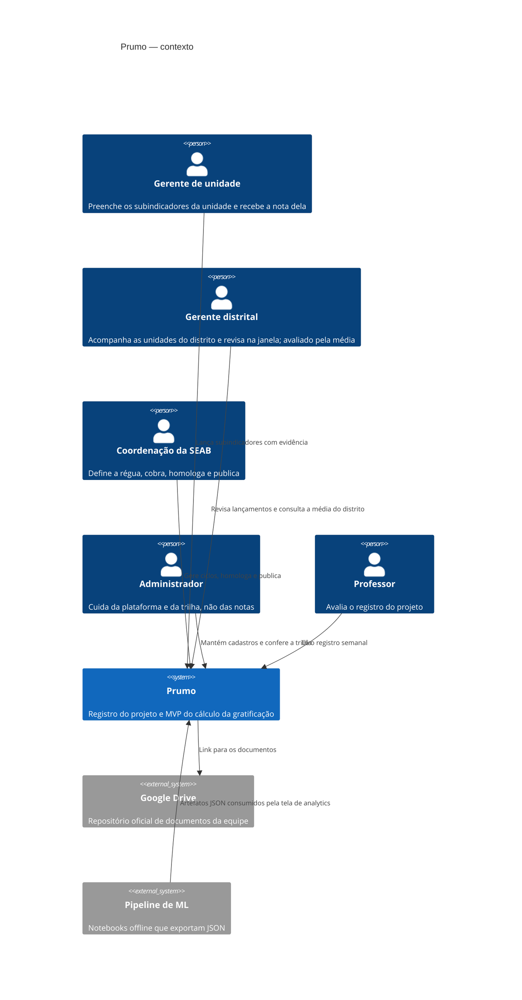
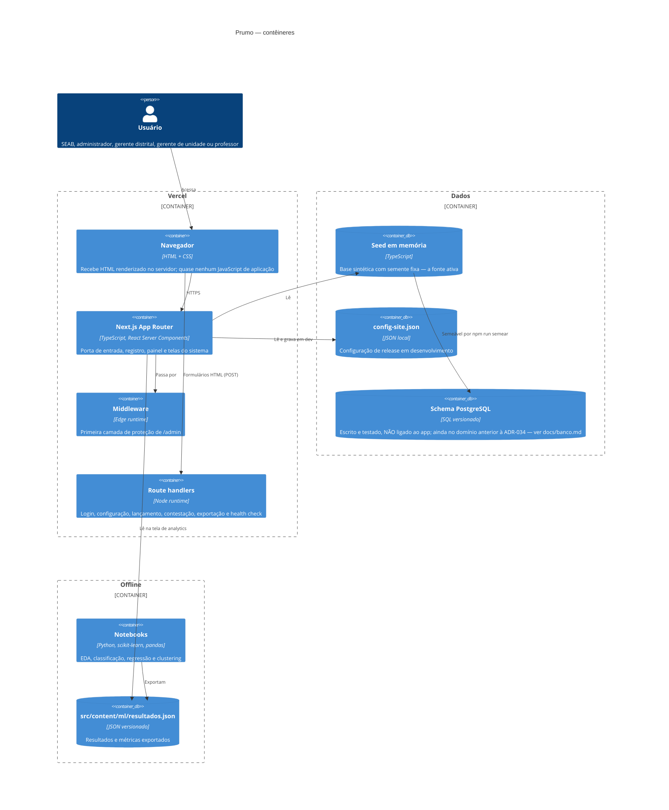
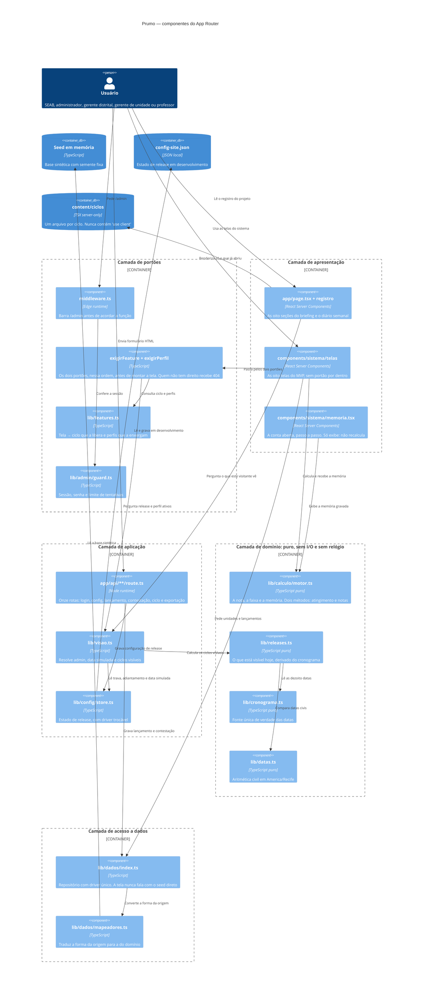
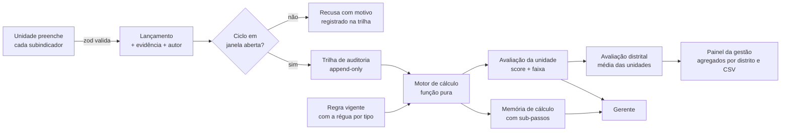

# Arquitetura

## Visão de contexto (C4 nível 1)

Os quatro primeiros atores são os que o cliente nomeou na reunião de 22/08 (ADR-034).

## Visão de contêineres (C4 nível 2)

## Visão de componentes (C4 nível 3)

Abertura do contêiner com mais lógica de negócio, o **Next.js App Router**. O estilo é
**monólito modularizado em camadas**, e o desenho existe para deixar isso visível: cada
camada é uma fronteira, e nenhuma seta pula a camada do meio.

A regra que o desenho tem de sustentar é a inversão de dependência para dentro: a camada de
domínio não conhece tela, rota, banco nem relógio. Toda seta que a cruza aponta **para ela**,
nunca a partir dela.

O que o desenho mostra e vale dizer em voz alta:

- **Nenhuma seta sai do domínio.** `motor.ts`, `releases.ts`, `cronograma.ts` e `datas.ts` não
  apontam para tela, rota, repositório nem arquivo. É o que permite testar o cálculo inteiro
  sem subir nada, e é por isso que o mesmo mês fechado devolve sempre o mesmo número.
- **O portão vem antes da tela, e são dois.** Release primeiro, perfil depois. Uma sanfona
  fechada não esconde nada do HTML, então a ordem é a proteção, não o CSS.
- **A tela nunca fala com o seed.** Ela fala com o repositório, e é isso que mantém a porta
  aberta para uma fonte persistente sem reescrever tela nenhuma.

## Visão de código (C4 nível 4)

O nível 4 abre o componente de maior risco do sistema: o **motor de cálculo**. É a única parte
em que um erro vira dinheiro errado no salário de alguém, e é a que a banca vai querer ver por
dentro.

O C4 não define notação própria para este nível, então vale o diagrama de classes, com as
funções puras como operações e os tipos como estruturas.

A cadeia de uma nota, na ordem em que o código a executa:

1. `regraVigente(competencia, regras)` escolhe a versão da regra pela competência. Nunca por
   "a mais nova": um mês de fevereiro recalculado em dezembro continua usando a regra de
   fevereiro.
2. `aplicabilidadeDe(regra, tipoUnidade, indicador)` decide se aquele indicador vale para
   aquele tipo de unidade. Se não vale, ele não entra na conta nem na memória: para aquele
   tipo, ele simplesmente não existe.
3. `apurarSubindicador` transforma o lançamento em valor: valor direto, ou numerador ÷
   denominador × 100. Denominador zero e numerador maior que denominador viram aviso, não
   `#DIV/0!` nem nota cheia silenciosa.
4. `notaDoDegrau` converte o valor em nota de 0 a 1 pela régua da regra, no método de notas.
   A ordem dos degraus é que permite a faixa ideal, aquela em que passar do alvo também perde
   ponto.
5. A média das notas passa por `segundaGraduacaoDoIndicador`, quando a regra define uma.
6. O peso de cada indicador multiplica a nota, e a soma é dividida pela **soma dos pesos que
   entraram na conta**. É aí que mora a redistribuição do art. 8º: indicador sem lançamento
   sai, e o peso dele sai junto.
7. `faixaDoScore` traduz o número na classe: insatisfatório, regular, satisfatório, excelente.

Cada passo escreve sua linha na `MemoriaDeCalculo`. Nenhuma tela refaz a conta: elas exibem o
que o motor gravou, e é por isso que a tela não pode divergir do resultado.

## Fluxo de dados do cálculo

O motor compõe cada indicador pela média simples dos subindicadores apurados (razão =
numerador ÷ denominador, em percentual) e calcula o atingimento contra a meta que a regra
versionada define para o TIPO da unidade. As fórmulas de composição e agregação são
suposições declaradas, a validar com a planilha prometida pelo cliente.

## Decisões e por quês

**Serverless na Vercel.** O projeto é acadêmico e tem picos de acesso concentrados em
apresentações. Serverless entrega custo zero em repouso e escala nas bancas sem
provisionamento. O preço é o filesystem read-only, que forçou a decisão sobre o config
store (ver ADR-004 em `decisoes.md`).

**Server Components como padrão.** As telas são renderizadas no servidor e enviam quase
nenhum JavaScript de aplicação. Três consequências diretas: LCP baixo, superfície de
ataque menor no cliente e — a mais importante para este projeto — **conteúdo de release
futuro nunca chega ao navegador**, porque o módulo sequer é avaliado.

**Formulários HTML puros.** Login, lançamento, contestação e todas as ações do painel são
`<form method="post">` para route handlers. Sem estado de cliente, sem hidratação, sem
dependência de JavaScript habilitado. Também simplifica a CSP.

**Persistência: decisão adiada, com o trabalho preparatório feito.** O MVP roda com dados
sintéticos em memória, o que basta para demonstrar o processo inteiro e dispensa credencial
para qualquer pessoa da equipe rodar o projeto. O schema PostgreSQL — com RBAC espelhado em
políticas de RLS e quatro invariantes em gatilho — está escrito, versionado e testado
contra um banco real, mas não ligado à aplicação; desde a remodelagem pós-reunião
(ADR-034) ele modela o domínio anterior, com a pendência declarada em `banco.md`. O porquê
está em `decisoes.md` (ADR-011 e ADR-012). Se a persistência virar requisito, a troca é
acrescentar um driver e atualizar o SQL: as telas falam com `src/lib/dados/`, não com a
fonte.

**Pipeline de ML offline.** Treinar modelo em requisição não faz sentido aqui: os dados
mudam por ciclo, não por segundo. Os notebooks rodam offline, exportam JSON versionado e a
aplicação apenas lê. Isso mantém o app rápido e torna cada número da tela de analytics
rastreável até o notebook que o gerou.

**Observabilidade.** `/status` e `/api/status` expõem versão, commit, modo de dados, driver
de configuração, release público e latência de coleta. Logs estruturados ficam a cargo da
plataforma (Vercel), que já agrega por requisição.

**Ambientes.** Cada pull request gera um preview na Vercel — o que é, ao mesmo tempo, a
evidência de CI/CD pedida pela disciplina e o ambiente onde a equipe confere o que o
professor vai ver antes de publicar.
