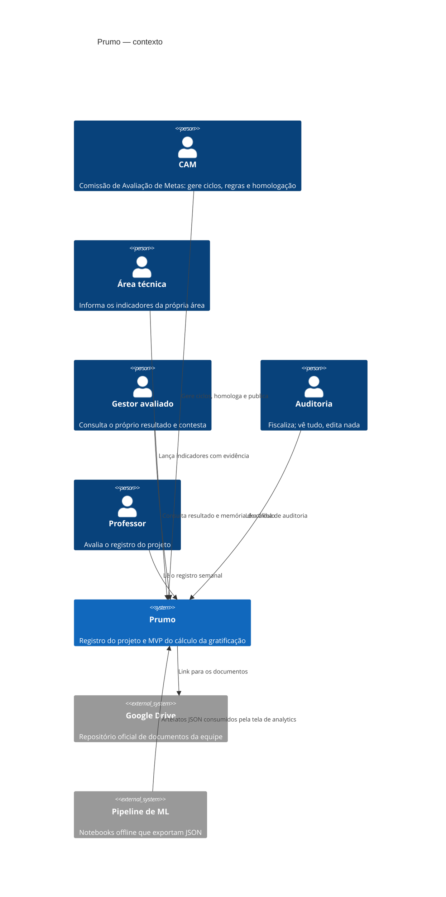
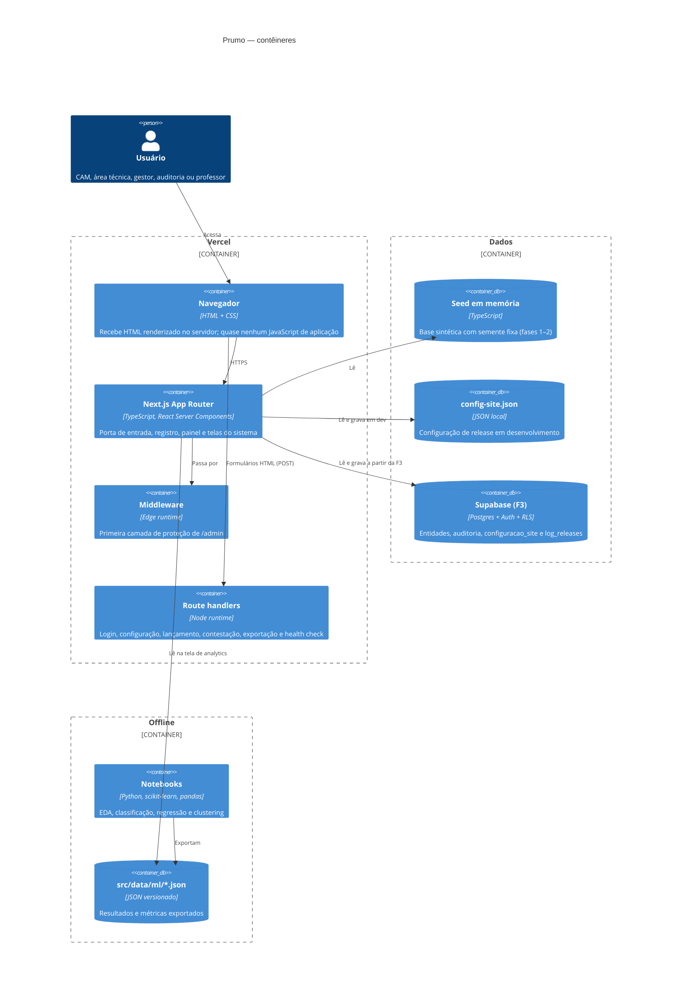
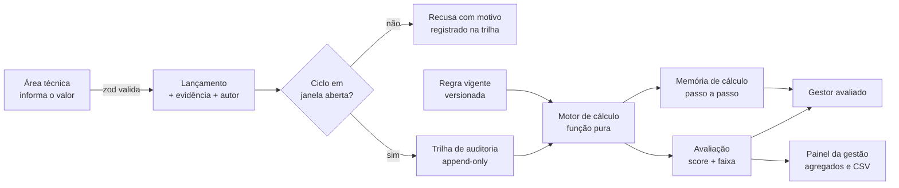

# Arquitetura

## Visão de contexto (C4 nível 1)

## Visão de contêineres (C4 nível 2)

## Fluxo de dados do cálculo

## Decisões e por quês

**Serverless na Vercel.** O projeto é acadêmico e tem picos de acesso concentrados em
apresentações. Serverless entrega custo zero em repouso e escala nas bancas sem
provisionamento. O preço é o filesystem read-only, que forçou a decisão sobre o config
store (ver ADR-004 em `decisoes.md`).

**Server Components como padrão.** As telas são renderizadas no servidor e enviam quase
nenhum JavaScript de aplicação. Três consequências diretas: LCP baixo, superfície de
ataque menor no cliente e — a mais importante para este projeto — **conteúdo de release
futuro nunca chega ao navegador**, porque o módulo sequer é avaliado.

**Formulários HTML puros.** Login, lançamento, contestação e todas as ações do painel são
`<form method="post">` para route handlers. Sem estado de cliente, sem hidratação, sem
dependência de JavaScript habilitado. Também simplifica a CSP.

**Postgres gerenciado (Supabase, a partir da F3).** RLS no banco permite espelhar o RBAC do
§8.1 como política de dados, não como `if` na aplicação. Auth, storage e Postgres no mesmo
provedor evitam integração extra num semestre curto.

**Pipeline de ML offline.** Treinar modelo em requisição não faz sentido aqui: os dados
mudam por ciclo, não por segundo. Os notebooks rodam offline, exportam JSON versionado e a
aplicação apenas lê. Isso mantém o app rápido e torna cada número da tela de analytics
rastreável até o notebook que o gerou.

**Observabilidade.** `/status` e `/api/status` expõem versão, commit, modo de dados, driver
de configuração, release público e latência de coleta. Logs estruturados ficam a cargo da
plataforma (Vercel), que já agrega por requisição.

**Ambientes.** Cada pull request gera um preview na Vercel — o que é, ao mesmo tempo, a
evidência de CI/CD pedida pela disciplina e o ambiente onde a equipe confere o que o
professor vai ver antes de publicar.
